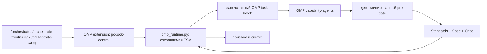

# orchestrate

**Languages:** [Русский](#русский) · [中文](#中文) · [English](#english)

A native **Oh My Pi (OMP)** control plane for Pocock-style engineering orchestration:
three public skill heads, model-independent routing, sealed OMP `task` dispatches, durable
state, and a fail-closed three-lens quality gate.

> The point is not to save tokens. The point is to make decomposition, explicit
> contracts, independent verification, and evidence part of the execution path.

---

## Русский

### Суть проекта

`orchestrate` превращает сессию **Oh My Pi (OMP)** в ведущего оркестратора сложной
инженерной работы. Лид проходит подготовительный хребет Покока, публикует полноценные
тикеты, а затем передаёт исполнение нативным OMP-агентам. Результат нельзя принять
одним рассуждением модели: принятие разрешает только сохраняемый управляющий контур
после детерминированных проверок и независимого ревью.

У оркестратора три публичных входа:

- **`/orchestrate`** — полный цикл для сырой задачи: триаж → уточнение → план → явное
  одобрение → публикация тикетов → исполнение → проверка → синтез.
- **`/orchestrate-frontier`** — тонкий вход для уже подготовленного фронтира тикетов. Он
  проверяет происхождение спецификации, одобрения и рёбер зависимостей и сразу входит
  в общий исполнительный цикл. Без доказуемого происхождения не стартует; когда
  трекер объективно недоступен, допускается только явная аттестация владельца с
  записанной причиной.
- **`/orchestrate-sweep`** — тонкий вход для закрытого run-local Прочёса: все тикеты,
  их приёмка и интеграция уже решены, владелец даёт явный witness, а runtime атомарно
  запечатывает полный локальный ledger и DAG. Это не опубликованный фронтир и не
  замена tracker provenance.

Все три головы используют одно исполнительное ядро. Они не содержат собственных копий
маршрутизации, бюджетов, ретраев или правил приёмки.

### Архитектура



- **Голова** — публичный скилл. Она ведёт разговор с владельцем и запрашивает только
  переходы, разрешённые текущей карточкой состояния.
- **Адаптер** — [`.omp/extensions/pocock-control/index.ts`](.omp/extensions/pocock-control/index.ts).
  Он регистрирует OMP-инструменты, перехватывает ровно один пустой вызов `task`,
  атомарно подменяет его запечатанным пакетным заданием, фиксирует реально
  разрешившуюся модель и связывает результат с попыткой.
- **Управляющий контур** —
  [`skill/orchestrate/tools/omp_runtime.py`](skill/orchestrate/tools/omp_runtime.py).
  Он владеет фазами, допустимыми переходами, маршрутизацией, лимитами попыток,
  резервом токенов, pre-gate, приёмкой и хэшированной карточкой состояния на диске.
- **Транспорт** — только нативный OMP `task` в пакетном режиме. Публичные головы не
  запускают CLI отдельных вендоров и не строят вложенный оркестратор.

Подробное архитектурное решение записано в
[ADR-0009](docs/adr/0009-native-omp-control-plane.md).

### Маршрутизация без привязки к моделям

Скиллы и runtime не содержат имён конкретных моделей. Они оперируют четырьмя ролями
OMP:

| Роль | Назначение |
|---|---|
| `@smol` | дешёвая механическая разведка и простые проверки |
| `@task` | стандартная реализация по полной спецификации |
| `@advisor` | сложная реализация или архитектурная работа |
| `@slow` | верхний уровень сложности и состязательная проверка |

Файлы [`.omp/agents/pocock-*.md`](.omp/agents/) связывают класс работы с ролью и
объявляют допустимые инструменты. Конкретную модель каждой роли выбирает профиль OMP.
Смена GPT, Gemini, Claude, Grok или другой модели не требует переписывать скиллы.
Перед каждым прогоном адаптер разрешает роли через OMP и сохраняет свидетеля
`provider/id/family`; fallback или незаявленная подмена модели отклоняется.

Маршрут выводится из сигналов тикета:

- **mechanical** — все шаги перечислимы заранее, решений не осталось, результат легко
  проверить;
- **skilled** — полная спецификация существует, задача требует реализации, а успех
  объективно проверяем;
- **judgment** — остаётся пространство решений, неоднозначность, риск или требуется
  архитектурная оценка.

Явно заниженный класс отклоняется. Ретраи не являются скрытым повтором: runtime
учитывает причину провала, число качественных попыток и минимально допустимый следующий
уровень.

### Сохраняемое состояние и fail-closed поведение

Каждый прогон получает `runId` и карточку состояния:

```text
runId · revision · stateHash · configFingerprint · manifestFingerprint · phase · nextActions
```

Полное состояние хранится в `$XDG_STATE_HOME/pocock-omp` (по умолчанию
`~/.local/state/pocock-omp`) отдельно для каждого рабочего каталога. Карточка
аутентифицирована HMAC-ключом с правами `0600` и закрепляет снимок
runtime/config/manifests. Устаревшая ревизия, неверный witness, повреждённый
файл, неизвестная модель, незапечатанный `task`, неверный результат или
повторный вызов переводят протокол в отказ, а не в догадку.

OMP-сессия хранит только зеркало карточки `pocock-state`. После возобновления сессии
адаптер сверяет зеркало с авторитетным состоянием на диске. Осиротевший вызов `task`
не может обойти runtime.

Пин runtime имеет две области жизни. Адаптер закрепляет байты отдельно для каждой
OMP-сессии, поэтому новая сессия может увидеть штатно установленное обновление.
Карточка закрепляет `runtimeFingerprint` на весь прогон: после изменения runtime
старый прогон доступен только через `status`/`report`, получает пустой
`nextActions` и не возобновляется. Работа продолжается новым прогоном из того же
долговечного провенанса.

### Изоляция и границы доверия

Установщик выбирает `task.isolation.mode: auto`, но runtime принимает и явно
закреплённый изолирующий backend OMP, например `rcopy`; режим `none` запрещён
([ADR-0010](docs/adr/0010-isolation-backend-policy.md)). В зависимости от системы
рабочая область создаётся как CoW-клон, overlayfs/ProjFS, `git worktree` либо
отдельная копия каталога. Для каждого агента дополнительно действует allowlist
инструментов из frontmatter. OMP возвращает patch без применения; runtime
проверяет и атомарно применяет допустимую волну.

Это **изоляция рабочей области и возможностей инструмента**, а не контейнер ОС, не
сетевой firewall и не защита от доверенного кода расширения. Проект не называет её
тем, чем она не является.

### Проверка и принятие

Перед LLM-ревью runtime уже привязал и хэшировал артефакт результата, затем выполняет
детерминированный pre-gate:

- запечатанные direct-argv команды и `git diff --check`, с ошибкой на конкретном
  producer attempt;
- diff-лимит каждого producer patch с централизованным откатом волны при превышении;
- для живого UI — challenge-bound browser/xdev evidence с точным критерием и
  успешным host-assert над наблюдаемым результатом.

Затем один пакет OMP запускает три независимые линзы:

1. **Standards** — соблюдение документированных правил проекта.
2. **Spec** — полнота и точность относительно тикета.
3. **Critic** — попытка опровергнуть результат и единственный вердикт `PASS`/`FAIL`.

Приёмка возможна только при `Critic=PASS` и отсутствии выживших блокирующих замечаний,
внесённых текущей работой. После приёмки runtime записывает телеметрию через единственный
писатель и лишь затем разрешает синтез.

### Установка

Требования:

- [Oh My Pi](https://github.com/can1357/oh-my-pi) CLI (`omp`);
- Python 3.12+ и `PyYAML`;
- `git`;
- `gh` для работы с GitHub Issues во фронтирном входе.

```bash
git clone https://github.com/shah1git/claude-orchestrate /opt/claude-orchestrate
cd /opt/claude-orchestrate

# Регистрирует снимок публичных скиллов, OMP-агентов и расширения копированием.
./install.sh

# Режим разработки: живые симлинки в текущий checkout.
./install.sh --link

# Явно применяет обязательные глобальные инварианты native task.
./install.sh --configure-omp
```

Обычная установка **не меняет** глобальную конфигурацию OMP. Флаг
`--configure-omp` осознанно устанавливает:

```yaml
async.enabled: false
task.batch: true
task.enableEffort: true
task.isolation.mode: auto
task.isolation.apply: false
task.isolation.merge: patch
task.maxRecursionDepth: 1
task.maxConcurrency: 6
retry.modelFallback: false
```

Эти значения закрепляют patch-capture как общий режим OMP в этом контуре:
OMP возвращает patch-артефакт без автоматического merge, а плоскость управления
сама проверяет его хеш, атрибуцию и `writablePaths`, после чего атомарно
применяет допустимую волну.

Проверка установки без сети:

```bash
bash scripts/verify-install.sh --offline
```

### Использование

```text
/orchestrate реализуй сложную многофайловую задачу
/orchestrate-frontier
/orchestrate-frontier label:ready-for-agent
/orchestrate-sweep выполни закрытый локальный прочёс
```

`/orchestrate` нужен для новой, неразобранной или decision-bearing работы.
`/orchestrate-frontier` нужен только тогда, когда спецификация, одобрение, тикеты и
зависимости уже опубликованы. `/orchestrate-sweep` нужен только для полного
неопубликованного локального ledger с заранее решёнными приёмкой и интеграцией,
явным witness владельца и независимой шириной DAG.

### Исторические компоненты

[`skill/orchestrate/tools/run_lane/`](skill/orchestrate/tools/run_lane/) сохранён как
исторический код прежнего внешнего CLI-транспорта и как материал для воспроизводимости
старых прогонов. Активные `/orchestrate`, `/orchestrate-frontier` и
`/orchestrate-sweep` его не вызывают.

### Полигон

[`benchmark/`](benchmark/) — античит-полигон сравнения моделей по ролям на
синтетическом домене. Ответы на время прогона закрыты, работа идёт в изолированных
каталогах, оценка детерминирована. Полигон не входит в управляющий контур OMP.

---

## 中文

### 项目简介

`orchestrate` 是 **Oh My Pi (OMP)** 的原生 Pocock 编排控制面。它有三个公共技能入口：

- **`/orchestrate`**：完整流程，用于尚未拆解的任务；执行分诊、澄清、计划、明确批准、
  工单发布、执行、验证和综合。
- **`/orchestrate-frontier`**：用于已经发布并建立依赖关系的工单前沿；先验证规格、批准和
  provenance，再直接进入执行循环。
- **`/orchestrate-sweep`**：用于闭合的 run-local sweep：工单、验收与集成均已决定，
  所有者给出明确 witness，runtime 原子封存完整 ledger 和 DAG；它不是已发布的 tracker
  frontier。

三个入口共享同一个确定性运行时：
[`skill/orchestrate/tools/omp_runtime.py`](skill/orchestrate/tools/omp_runtime.py)。
[`.omp/extensions/pocock-control/index.ts`](.omp/extensions/pocock-control/index.ts)
是薄 OMP 适配器；唯一的工作传输是原生批量 `task`。

### 与模型解耦

路由只使用 OMP 角色 `@smol`、`@task`、`@advisor`、`@slow`。具体模型由 OMP
配置决定；技能中没有固定的 GPT、Gemini、Claude 或 Grok 名称。适配器在运行时记录
实际 `provider/id/family`，拒绝 fallback 或未声明的替换。

### 状态、隔离与质量门

运行状态持久化到磁盘，并由 `runId`、单调递增的 `revision` 与哈希链保护。安装器默认使用
`task.isolation.mode: auto`；runtime 也接受显式选择的 OMP 隔离 backend（例如
`rcopy`），但拒绝 `none`（[ADR-0010](docs/adr/0010-isolation-backend-policy.md)）。
工作区可以使用 CoW、overlayfs/ProjFS、git worktree 或目录副本；agent frontmatter
提供工具白名单。它不是操作系统容器或网络防火墙。

结果必须通过确定性 pre-gate 和三重独立审查：**Standards**、**Spec**、**Critic**。
只有 Critic 可以给出最终 PASS/FAIL；任何仍存在的本次工作阻塞项都会拒绝接收。

### 安装与使用

./install.sh                 # 复制并注册技能、OMP agents 和 extension
./install.sh --link          # 仅开发：使用指向当前 checkout 的符号链接
./install.sh --configure-omp # 复制安装并明确写入全局 OMP task 不变量
bash scripts/verify-install.sh --offline
```

新任务、裸“orchestrate”请求或任何未决决策使用 `/orchestrate <任务>`；已经准备好的
已发布工单前沿使用 `/orchestrate-frontier`；仅当完整未发布的本地 ledger、验收和集成
已经闭合并有明确 owner witness 时使用 `/orchestrate-sweep`。旧 `run_lane` 仅保留为
历史兼容代码，公共入口不再调用它。

---

## English

### Overview

`orchestrate` is a native **Oh My Pi (OMP)** control plane for Pocock-style engineering
orchestration. It exposes three public skill heads:

- **`/orchestrate`** — the full path for raw work: triage, clarification, plan, explicit
  approval, ticket publication, execution, verification, and synthesis.
- **`/orchestrate-frontier`** — the thin path for an already-published ticket frontier. It
  verifies specification, approval, provenance, and dependency edges before execution.
- **`/orchestrate-sweep`** — the thin path for a closed run-local sweep: every ticket,
  acceptance criterion, and integration decision is already decided, the owner supplies an
  explicit witness, and the runtime atomically seals the complete ledger and DAG. It is not
  a tracker frontier.

All three heads use one deterministic runtime,
[`skill/orchestrate/tools/omp_runtime.py`](skill/orchestrate/tools/omp_runtime.py), and one
thin OMP adapter,
[`.omp/extensions/pocock-control/index.ts`](.omp/extensions/pocock-control/index.ts).
Native batched OMP `task` is the only worker transport.

### Model-independent routing

Routing targets OMP roles `@smol`, `@task`, `@advisor`, and `@slow`; the OMP profile
selects the concrete model behind each role. Agent definitions in
[`.omp/agents/`](.omp/agents/) declare capabilities and tool allowlists. The adapter
records the model actually resolved by OMP and refuses fallback or undeclared
substitution.

### Durable state, isolation, and gates

The control plane persists a hash-chained state machine with monotonic revisions. It
owns routing, retry limits, budget reservation, deterministic pre-gates, review
adjudication, and acceptance. OMP session entries contain only a mirrored state card;
resume re-hydrates it from authoritative disk state.

The installer defaults to `task.isolation.mode: auto`; the runtime also accepts an
explicit isolated OMP backend such as `rcopy`, but rejects `none`
([ADR-0010](docs/adr/0010-isolation-backend-policy.md)). Workspaces use CoW,
overlayfs/ProjFS, `git worktree`, or a directory copy, plus per-agent tool
allowlists. This is not an OS container or a network sandbox.

Every accepted deliverable passes deterministic checks and three independent lenses:
**Standards**, **Spec**, and **Critic**. Critic owns the sole PASS/FAIL verdict, while any
surviving introduced blocker refuses acceptance.

### Install and verify

Requirements: `omp`, Python 3.12+ with `PyYAML`, `git`, and `gh` for GitHub-backed
frontiers.

```bash
git clone https://github.com/shah1git/claude-orchestrate /opt/claude-orchestrate
cd /opt/claude-orchestrate
./install.sh
./install.sh --configure-omp     # explicit global OMP task invariants
bash scripts/verify-install.sh --offline
```

A normal install copies one detached snapshot of the skills, OMP agents, and extension
without changing global OMP settings. Use `--link` only for live-checkout development.
Invoke `/orchestrate <task>` for raw or decision-bearing work, `/orchestrate-frontier` for
a prepared published frontier, and `/orchestrate-sweep` only for a closed unpublished local
ledger with pre-decided acceptance and integration plus an explicit owner witness.

The legacy [`run_lane`](skill/orchestrate/tools/run_lane/) executor remains only for
historical reproduction; no public head calls it.
---

## Repository layout

```text
.omp/config.yml                         repository OMP task invariants
.omp/agents/pocock-*.md                 native capability-agent definitions
.omp/extensions/pocock-control/         thin OMP adapter and dispatch seal
skill/orchestrate/SKILL.md               full orchestration head
skill/orchestrate-frontier/SKILL.md      prepared-frontier head
skill/orchestrate-sweep/SKILL.md         closed local-sweep head
skill/orchestrate/tools/omp_runtime.py   deterministic persisted control plane
skill/orchestrate/tools/run_lane/         historical external-CLI executor
skill/orchestrate/config.yaml            versioned routing and quality policy
benchmark/                               cheat-resistant role polygon
docs/adr/                                architectural decisions
install.sh                               link/copy installer; optional OMP configuration
scripts/verify-install.sh                offline installation verifier
```

## License

MIT — see [LICENSE](LICENSE).
