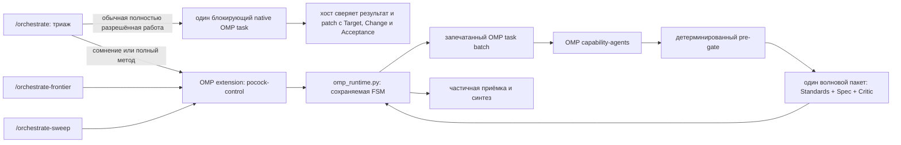

# orchestrate

**Languages:** [Русский](#русский) · [中文](#中文) · [English](#english)

A native **Oh My Pi (OMP)** control plane for Pocock-style engineering orchestration:
three public skill heads, model-independent routing, sealed OMP `task` dispatches, durable
state, and a fail-closed three-lens quality gate.

> The point is not to save tokens. The point is to make decomposition, explicit
> contracts, independent verification, and evidence part of the execution path.

---

## Русский

### Суть проекта

`orchestrate` превращает сессию **Oh My Pi (OMP)** в ведущего оркестратора
сложной инженерной работы. До входа в Pocock `/orchestrate` триажирует обычную
полностью разрешённую работу: только один самодостаточный блокирующий пакет может
быть выполнен напрямую. Во всех остальных случаях лид проходит подготовительный
хребет Покока, публикует полноценные Тикеты и передаёт исполнение нативным
OMP-агентам. Результат нельзя принять одним рассуждением модели: принятие
разрешает только сохраняемый управляющий контур после детерминированных проверок
и независимого ревью.

У оркестратора три публичных входа:

- **`/orchestrate`** — сначала триаж. Прямой путь допустим только для обычной
  полностью разрешённой работы с самодостаточными `Target`, `Change`, `Acceptance`,
  исполнимой ровно одним Исполнителем в одном блокирующем нативном пакете; хост
  независимо проверяет, что наблюдаемый результат и patch соответствуют полному
  контракту `Target`, `Change` и `Acceptance`. Любое сомнение, сырая или
  decision-bearing работа ведут в полный цикл:
  уточнение → план → явное одобрение → публикация Тикетов → исполнение → проверка
  → синтез.
- **`/orchestrate-frontier`** — тонкий вход для уже подготовленного Фронтира
  Тикетов. Он всегда вызывает `pocock_enter`, проверяет происхождение спецификации,
  одобрения и рёбер зависимостей и затем входит в общий исполнительный цикл.
- **`/orchestrate-sweep`** — тонкий вход для закрытого run-local Прочёса: все
  Тикеты, их приёмка и интеграция уже решены, владелец даёт явный witness, а runtime
  атомарно запечатывает полный локальный ledger и DAG. Он всегда вызывает
  `pocock_enter`; это не опубликованный Фронтир и не замена tracker provenance.

Прямой путь не создаёт Pocock-Прогон, Карточку состояния или Линзы и никогда не
принимает Фронтир либо Прочёс. После входа все три Головы используют одно
исполнительное ядро; они не содержат собственных копий маршрутизации, Бюджетов,
ретраев или правил приёмки.

### Архитектура



- **Голова** — публичный скилл. Она ведёт разговор с владельцем и запрашивает только
  переходы, разрешённые текущей карточкой состояния.
- **Адаптер** — [`.omp/extensions/pocock-control/index.ts`](.omp/extensions/pocock-control/index.ts).
  Он регистрирует OMP-инструменты, перехватывает ровно один пустой вызов `task`,
  атомарно подменяет его запечатанным пакетным заданием, фиксирует реально
  разрешившуюся модель и связывает результат с попыткой.
- **Управляющий контур** —
  [`skill/orchestrate/tools/omp_runtime.py`](skill/orchestrate/tools/omp_runtime.py).
  Он владеет единственным долговечным Прогоном рабочего каталога, фазами, допустимыми
  переходами, маршрутизацией, лимитами попыток, резервом токенов, pre-gate, приёмкой и
  HMAC-аутентифицированной Карточкой состояния на диске.
- **Транспорт Pocock** — только нативный OMP `task` в пакетном режиме. Публичные
  Головы не запускают CLI отдельных вендоров и не строят вложенный оркестратор.
  Исключение до `pocock_enter` — строго ограниченный Прямой путь `/orchestrate`;
  это один блокирующий нативный пакет с хостовой проверкой, а не второй Прогон.

Подробное архитектурное решение записано в
[ADR-0009](docs/adr/0009-native-omp-control-plane.md).

### Маршрутизация без привязки к моделям

Скиллы и runtime не маршрутизируют по именам конкретных моделей и не
классифицируют их по поставщикам или семействам. Они оперируют слотами — именами
ролей OMP:

| Слот | Запасной | Назначение |
|---|---|---|
| `@pocock-scout` | `@pocock-scout-backup` | дешёвая механическая разведка |
| `@pocock-builder` | `@pocock-builder-backup` | реализация по полной спецификации |
| `@pocock-architect` | `@pocock-architect-backup` | архитектурная работа и суждение |
| `@pocock-lens-standards` | `@pocock-lens-standards-backup` | линза Standards |
| `@pocock-lens-spec` | `@pocock-lens-spec-backup` | линза Spec |
| `@pocock-lens-critic` | `@pocock-lens-critic-backup` | линза Critic |

Какая модель стоит за ролью — решает владелец в основном конфиге OMP
(`$(omp config path)/config.yml`).
Замена модели **внутри** роли при недоступности принадлежит целиком OMP
(`retry.fallbackChains`) и контуру не видна. Замена **Слота** — уровень контура:
он переходит на парный `-backup`, когда это требует сохранённая диагностика.

Независимость трёх Линз обеспечена структурно: множество Слотов Производителей и
множество Слотов Линз не пересекаются, Слоты трёх Линз попарно различны, а
основной Слот не равен запасному; это проверяется при загрузке конфигурации
(`validate_slot_disjointness`). Перед раздачей Линз runtime дополнительно
fail-closed сравнивает непрозрачные строки `resolvedModel`: точное совпадение
модели Линзы с моделью любого Производителя Волны даёт
`independent_reviewer_unavailable`. Это не классификация поставщика или
семейства и не таблица вендоров.

Файлы [`.omp/agents/pocock-*.md`](.omp/agents/) объявляют способности Слота и
допустимые инструменты. Адаптер передаёт `observedModel` и `modelFallback`, а
runtime сохраняет их как оперативную телеметрию; маршрут задаётся Слотом, а
точное сравнение `resolvedModel` применяется только перед раздачей Линз.

Маршрут выводится из сигналов Тикета:

- **mechanical** — все шаги перечислимы заранее, решений не осталось, результат легко
  проверить;
- **skilled** — полная спецификация существует, задача требует реализации, а успех
  объективно проверяем;
- **judgment** — остаётся пространство решений, неоднозначность, риск или требуется
  архитектурная оценка.

Явно заниженный класс отклоняется. Если в payload повтора нет диагноза, runtime
использует сохранённый `lastFailureKind`. `capability` поднимает класс
`mechanical` → `skilled` → `judgment` и выбирает более глубокий Слот; пишущий
Тикет останавливается на `skilled` и переходит на запасной Слот, а исчерпавший
глубину `judgment` блокируется с `escalation_exhausted`. `availability`
переводит Тикет на парный запасной Слот. При частичной приёмке отклонённый
Тикет маршрутизируется сразу по записанной причине отказа, без отдельного шага
`retry`.

### Сохраняемое состояние и fail-closed поведение

Каждый Pocock-Прогон получает `runId` и Карточку состояния:

```text
runId · revision · stateHash · configFingerprint · manifestFingerprint · phase · nextActions
```

Полное состояние хранится в `$XDG_STATE_HOME/pocock-omp` (по умолчанию
`~/.local/state/pocock-omp`) по рабочему каталогу. Ядро допускает ровно один
нетерминальный долговечный Прогон на этот каталог между всеми OMP-сессиями.
Новая сессия вызывает `pocock_status` без `runId`; ядро находит Прогон на диске,
а адаптер гидратирует его Карточку. Бюджет и счётчики попыток принадлежат Прогону
и не сбрасываются новой сессией.

Карточка аутентифицирована HMAC-ключом с правами `0600` и закрепляет снимок
runtime/config/manifests. Устаревшая ревизия, повреждённый файл, подделанное
свидетельство, незапечатанный `task`, неверный результат или повторный вызов
переводят протокол в отказ, а не в догадку. Ошибка связывания раздачи, состояния
либо запечатанных входов останавливает всю команду; ошибка, безопасно связанная
с одной попыткой, не отбрасывает её соседей.

Адаптер хранит лишь зеркало Карточки и его Hub-guard действует в пределах
сессии. После settlement нативный `task` однократен: нельзя ждать или оживлять
его через Hub; повтор — новая запечатанная попытка, разрешённая текущей Карточкой.
Восстанавливаемая ошибка не оправдывает автоматических отмены и повторного
входа. Обычная отмена возможна только по явному отказу владельца от работы.
Новый вход может заменить активный Прогон лишь при установленном самим ядром
расхождении runtime или capability-agent manifests. Ядро пишет replacement-журнал,
сначала создаёт неактивную замену, затем откатывает непринятые patch, отменяет
старый Прогон со ссылкой `supersededBy` и активирует замену; после сбоя `start`
или `status` идемпотентно завершают эту последовательность.

### Запечатанные входы и зависимости

`INPUTS` изолированного Тикета содержит полный встроенный контракт, разрешимый
репозиторный путь, полный URL, полностью квалифицированный `issue://owner/repo/N`
либо принятый артефакт предшественника. Сокращения `#123` и `Issue #123` не
являются источником: ядро сообщает
`incomplete_tracker_reference`. Зависимость называет принятый выход и
установленный факт, который он предоставляет; поручения читать трекер, IRC или
историю разговора недопустимы.

### Изоляция и границы доверия

Установщик выбирает `task.isolation.mode: auto`, но runtime принимает и явно
закреплённый изолирующий backend OMP, например `rcopy`; режим `none` запрещён
([ADR-0010](docs/adr/0010-isolation-backend-policy.md)). В зависимости от системы
рабочая область создаётся как CoW-клон, overlayfs/ProjFS, `git worktree` либо
отдельная копия каталога. Для каждого агента дополнительно действует allowlist
инструментов из frontmatter. OMP возвращает patch без применения; runtime
проверяет и атомарно применяет допустимую волну.

Это **изоляция рабочей области и возможностей инструмента**, а не контейнер ОС, не
сетевой firewall и не защита от доверенного кода расширения. Проект не называет её
тем, чем она не является.

### Проверка и принятие

Перед LLM-ревью runtime привязывает и хэширует артефакт результата, затем
выполняет детерминированный pre-gate:

- запечатанные direct-argv команды и `git diff --check`, с ошибкой на конкретной
  producer attempt;
- diff-лимит каждого producer patch;
- для живого UI — challenge-bound browser/xdev evidence с точным критерием и
  успешным host-assert над наблюдаемым результатом.

Затем для **всей Волны** и только её прошедшего pre-gate подмножества запускается
один пакет из трёх различных независимых Линз. Волна может законно смешивать
Тикеты классов `mechanical`, `skilled` и `judgment` на соответствующих Слотах.
Непересечение Слотов Производителей и Линз, попарное различие трёх Линз и
различие основного и запасного Слотов проверяются при загрузке конфигурации.
Перед раздачей runtime fail-closed отклоняет Волну с
`independent_reviewer_unavailable`, если непрозрачная строка `resolvedModel`
любой Линзы в точности совпала со строкой любого Производителя; поставщик и
семейство при этом не выводятся. Каждая Линза возвращает
`{lens, summary, reports:[{attemptId, summary, findings, verdict}]}` с отчётом
для каждой прошедшей producer attempt. Standards и Spec дают `NO_VERDICT`;
только Critic даёт `PASS`/`FAIL`. Ошибка одной Линзы повторяет только её, а не
всю Волну; успешная Линза на запасном Слоте снимает свою метку запасного Слота.
Приёмка сохраняет уже прошедшие Тикеты и для каждого нового требует `Critic=PASS`
и отсутствия выживших блокирующих замечаний, внесённых текущей работой.

### Установка

Требования:

- [Oh My Pi](https://github.com/can1357/oh-my-pi) CLI (`omp`);
- Python 3.12+ и `PyYAML`;
- `git`;
- `gh` для работы с GitHub Issues во фронтирном входе.

На новой машине весь переносимый профиль OMP, три публичные Головы, их
capability-агенты, расширение и хребет Покока устанавливаются одной командой:

```bash
curl -fsSL https://raw.githubusercontent.com/shah1git/claude-orchestrate/main/bootstrap-machine.sh | bash
```

Скрипт клонирует или обновляет репозиторий в
`${XDG_DATA_HOME:-~/.local/share}/claude-orchestrate`, сохраняет прежние
`config.yml` и `WATCHDOG.md` вне реестра OMP, устанавливает переносимый профиль и
запускает полную самопроверку. OAuth, API-ключи, согласие `dev.autoqaConsent`,
сессии и машинное состояние не переносятся; вендоры авторизуются владельцем после
установки.

Ручная установка:

```bash
git clone https://github.com/shah1git/claude-orchestrate /opt/claude-orchestrate
cd /opt/claude-orchestrate

# Регистрирует снимок публичных скиллов, OMP-агентов и расширения копированием.
./install.sh

# Режим разработки: живые симлинки в текущий checkout.
./install.sh --link

# Явно применяет обязательные глобальные инварианты native task.
./install.sh --configure-omp
```

Обычная установка записывает в основной конфиг OMP только именные роли
`pocock-*` и их `retry.fallbackChains`, сохраняя остальные настройки. Флаг
`--configure-omp` дополнительно устанавливает глобальные task-инварианты:

```yaml
async.enabled: false
task.batch: true
task.enableEffort: true
task.isolation.mode: auto
task.isolation.apply: false
task.isolation.merge: patch
task.maxRecursionDepth: 1
task.maxConcurrency: 6
retry.modelFallback: true
```

Эти значения закрепляют patch-capture как общий режим OMP в этом контуре:
OMP возвращает patch-артефакт без автоматического merge, а плоскость управления
сама проверяет его хеш, атрибуцию и `writablePaths`, после чего атомарно
применяет допустимую волну.

Проверка установки без сети:

```bash
bash scripts/verify-install.sh --offline
```

### Использование

```text
/orchestrate обнови один полностью описанный файл
/orchestrate реализуй сложную многофайловую задачу
/orchestrate-frontier
/orchestrate-frontier label:ready-for-agent
/orchestrate-sweep выполни закрытый локальный прочёс
```

`/orchestrate` сначала выбирает Прямой путь только при всех его строгих условиях;
иначе он начинает полный метод через `pocock_enter`. `/orchestrate-frontier` нужен
только тогда, когда спецификация, одобрение, Тикеты и зависимости уже опубликованы,
и всегда входит через `pocock_enter`. `/orchestrate-sweep` нужен только для полного
неопубликованного локального ledger с заранее решёнными приёмкой и интеграцией,
явным witness владельца и независимой шириной DAG; он также всегда входит через
`pocock_enter`. Ни Фронтир, ни Прочёс не могут быть переданы Прямому пути.

### Исторические компоненты

[`skill/orchestrate/tools/run_lane/`](skill/orchestrate/tools/run_lane/) сохранён как
исторический код прежнего внешнего CLI-транспорта и как материал для воспроизводимости
старых прогонов. Активные `/orchestrate`, `/orchestrate-frontier` и
`/orchestrate-sweep` его не вызывают.

### Полигон

[`benchmark/`](benchmark/) — античит-полигон сравнения моделей по ролям на
синтетическом домене. Ответы на время прогона закрыты, работа идёт в изолированных
каталогах, оценка детерминирована. Полигон не входит в управляющий контур OMP.

---

## 中文

### 项目简介

`orchestrate` 是 **Oh My Pi (OMP)** 的原生 Pocock 编排控制面。它有三个公共技能入口：

- **`/orchestrate`**：先分诊；只有完全明确的普通工作、具备自包含的
  `Target`、`Change`、`Acceptance`，并可由一个阻塞式原生 `task` 批次中的单个 worker
  完成时，才可走 direct path。host 必须独立核验可观察结果和 patch 是否符合完整的
  `Target`、`Change`、`Acceptance` 合同；任何疑问都进入完整 Pocock 流程。
- **`/orchestrate-frontier`**：用于已经发布并建立依赖关系的工单前沿；它始终调用
  `pocock_enter`，再验证规格、批准和 provenance。
- **`/orchestrate-sweep`**：用于闭合的 run-local sweep：工单、验收与集成均已决定，
  所有者给出明确 witness，runtime 原子封存完整 ledger 和 DAG；它始终调用
  `pocock_enter`，不是已发布的 tracker frontier。

direct path 不创建 Pocock run、状态卡或 lenses，也绝不接收 frontier 或 sweep。三个
入口在进入 Pocock 后共享同一个确定性运行时：
[`skill/orchestrate/tools/omp_runtime.py`](skill/orchestrate/tools/omp_runtime.py)；
[`.omp/extensions/pocock-control/index.ts`](.omp/extensions/pocock-control/index.ts)
是薄 OMP 适配器；唯一的 Pocock 工作传输是原生批量 `task`。

### 与模型解耦

路由只使用槽位，即 OMP 角色名 `@pocock-scout`、`@pocock-builder`、
`@pocock-architect` 与三个镜头槽位 `@pocock-lens-*`，每个槽位都有配对的
`-backup`。具体模型由 OMP 主配置（`$(omp config path)/config.yml`）决定；代码中没有任何
GPT、Gemini、Claude、Grok 或 Qwen 名称，也没有供应商白名单。角色**内部**的模型替换
完全属于 OMP（`retry.fallbackChains`）；**角色本身**的替换属于编排回路：槽位耗尽时
切换到配对的 `-backup`。三个镜头的独立性由结构保证——生产者槽位集合与镜头槽位集合
互不相交，配置加载时即校验。适配器将 `observedModel` 和 `modelFallback` 记录为运行时
遥测；它们本身不会拒绝一次尝试，也不影响验收门。

### 状态、隔离与质量门

控制面在每个工作目录中只允许一个非终态、持久化的 Pocock run。新 OMP 会话以没有
`runId` 的 `pocock_status` 查找并水合它；预算和尝试计数不会重置。可恢复错误不会自动
cancel-and-re-enter；普通取消只允许明确的 owner abandonment。只有 core 自身确认已有
`runtime_mismatch` 时，新入口才能替换活动 run；core 先持久化 replacement journal
并完整写入非活动的 staged replacement，再取消旧 run，最后激活 staged replacement。
适配器的 Hub guard 仅限会话，已 settlement 的原生 `task` 是 one-shot，不能通过
Hub 等待或复活。

结果必须通过确定性 pre-gate。随后只有通过 pre-gate 的 producer subset 进入一个
wave-level 三 lens 包：独立的 **Standards**、**Spec**、**Critic** 都报告每个 producer
attempt。Standards/Spec 给出 `NO_VERDICT`，仅 Critic 给出 `PASS`/`FAIL`；仅失败 lens
重试，已通过工单保持已接收。

### 安装与使用

在新机器上一条命令即可安装可移植 OMP 配置、三个公共入口、capability agents、
extension 和 Pocock spine：

```bash
curl -fsSL https://raw.githubusercontent.com/shah1git/claude-orchestrate/main/bootstrap-machine.sh | bash
```

脚本不会迁移 OAuth、API keys、用户 consent、sessions 或机器运行状态；安装完成后由
owner 自行登录供应商。手动安装仍然可用：

```bash
./install.sh                 # 复制并注册技能、OMP agents 和 extension
./install.sh --link          # 仅开发：使用指向当前 checkout 的符号链接
./install.sh --configure-omp # 复制安装并明确写入全局 OMP task 不变量
bash scripts/verify-install.sh --offline
```

新任务、裸“orchestrate”请求或任何未决决策使用 `/orchestrate <任务>`；direct path 仅用于
一个完全明确、普通且自包含的任务，并在单个 blocking `task` batch 中只运行一个 worker；
否则调用 `pocock_enter`。已经准备好
的已发布工单前沿始终使用 `/orchestrate-frontier`，闭合的未发布本地 ledger 始终使用
`/orchestrate-sweep`；两者都不允许 direct path。旧 `run_lane` 仅保留为历史兼容代码，
公共入口不再调用它。

---

## English

### Overview

`orchestrate` is a native **Oh My Pi (OMP)** control plane for Pocock-style engineering
orchestration. It exposes three public skill heads:

- **`/orchestrate`** — triages first. The direct path is available only to fully resolved
  ordinary work with self-contained `Target`, `Change`, and `Acceptance`, executable by
  exactly one worker item in one blocking native `task` batch and independently verified
  by the host against the complete `Target`, `Change`, and `Acceptance` contract; doubt
  enters full Pocock.
- **`/orchestrate-frontier`** — the thin path for an already-published ticket frontier.
  It always calls `pocock_enter`, then verifies specification, approval, provenance, and
  dependency edges before execution.
- **`/orchestrate-sweep`** — the thin path for a closed run-local sweep: every ticket,
  acceptance criterion, and integration decision is already decided, the owner supplies an
  explicit witness, and the runtime atomically seals the complete ledger and DAG. It always
  calls `pocock_enter`; it is not a tracker frontier.

The direct path creates no Pocock run, state card, or lenses and never accepts a frontier
or sweep. Once inside Pocock, all heads use one deterministic runtime,
[`skill/orchestrate/tools/omp_runtime.py`](skill/orchestrate/tools/omp_runtime.py), and one
thin OMP adapter, [`.omp/extensions/pocock-control/index.ts`](.omp/extensions/pocock-control/index.ts).
Native batched OMP `task` is the only Pocock worker transport.

### Model-independent routing

Routing targets slots — that is, OMP role names: `@pocock-scout`, `@pocock-builder`,
`@pocock-architect`, and the three lens slots `@pocock-lens-*`, each paired with a
`-backup`. The model behind a role is chosen in the main OMP config
(`$(omp config path)/config.yml`);
the contour holds no model names and no provider allowlist, so admitting a model from a
new provider is a config edit alone. Replacing a model *within* a role belongs entirely
to OMP (`retry.fallbackChains`); replacing the *role* belongs to the contour, which
moves to the paired `-backup` once a slot is spent. Lens independence is structural:
producer slots and lens slots are disjoint sets, checked at config load. Agent
definitions in [`.omp/agents/`](.omp/agents/) declare capabilities and tool allowlists.
The adapter passes `observedModel` and `modelFallback` to the runtime as operational
telemetry; neither rejects an attempt nor affects acceptance gates.

### Durable state, isolation, and gates

The control plane permits exactly one nonterminal durable run per workspace. A new OMP
session calls `pocock_status` without `runId` to find and hydrate it; its budget and
attempt counters persist. Recoverable failure never triggers automatic cancel-and-re-enter;
explicit owner abandonment is the only ordinary cancellation path. A new entry may replace
an active run only when the core itself proves `runtime_mismatch`; the core first persists
the replacement journal and complete inactive staged replacement, then cancels the old run
and activates the staged replacement. The adapter's Hub guard is session-local, and a
settled native `task` is one-shot: it is never waited on or revived through Hub.

The installer defaults to `task.isolation.mode: auto`; the runtime also accepts an
explicit isolated OMP backend such as `rcopy`, but rejects `none`
([ADR-0010](docs/adr/0010-isolation-backend-policy.md)). Workspaces use CoW,
overlayfs/ProjFS, `git worktree`, or a directory copy, plus per-agent tool
allowlists. This is not an OS container or a network sandbox.

Every pre-gate-passed producer subset receives one wave-level package of exactly three
distinct independent lenses: **Standards**, **Spec**, and **Critic**. Each reports each
producer attempt; Standards and Spec emit `NO_VERDICT`, and Critic owns the sole
`PASS`/`FAIL`. Only a failed lens is retried, and partial acceptance preserves passing
tickets.

### Install and verify

Requirements: `omp`, Python 3.12+ with `PyYAML`, `git`, and `gh` for GitHub-backed
frontiers.

On a new machine, install the portable OMP profile, all three public heads, their
capability agents, the extension, and the Pocock spine with one command:

```bash
curl -fsSL https://raw.githubusercontent.com/shah1git/claude-orchestrate/main/bootstrap-machine.sh | bash
```

The script clones or updates the checkout under
`${XDG_DATA_HOME:-~/.local/share}/claude-orchestrate`, backs up an existing
`config.yml` and `WATCHDOG.md` outside OMP discovery, restores the portable profile,
and runs the full verifier. It deliberately excludes OAuth, API keys, user consent,
sessions, and machine runtime state; the owner logs in to each provider afterward.

Manual installation:

```bash
git clone https://github.com/shah1git/claude-orchestrate /opt/claude-orchestrate
cd /opt/claude-orchestrate
./install.sh
./install.sh --configure-omp     # explicit global OMP task invariants
bash scripts/verify-install.sh --offline
```

A normal install copies one detached snapshot of the skills, OMP agents, and extension,
then writes only the namespaced `pocock-*` roles and their `retry.fallbackChains` to the
main OMP config. It preserves every unrelated setting. Use `--link` only for
live-checkout development.
Invoke `/orchestrate <task>` for raw or decision-bearing work, or for the narrowly
eligible direct ordinary task described above; all other `/orchestrate` inputs enter
Pocock. `/orchestrate-frontier` is always for a prepared published frontier and
`/orchestrate-sweep` always for a closed unpublished local ledger with pre-decided
acceptance and integration plus an explicit owner witness. Neither can use the direct
path.

The legacy [`run_lane`](skill/orchestrate/tools/run_lane/) executor remains only for
historical reproduction; no public head calls it.
---

## Repository layout

```text
.omp/agents/pocock-*.md                 native capability-agent definitions
.omp/extensions/pocock-control/         thin OMP adapter and dispatch seal
skill/orchestrate/SKILL.md               full orchestration head
skill/orchestrate-frontier/SKILL.md      prepared-frontier head
skill/orchestrate-sweep/SKILL.md         closed local-sweep head
skill/orchestrate/tools/omp_runtime.py   deterministic persisted control plane
skill/orchestrate/tools/run_lane/         historical external-CLI executor
skill/orchestrate/config.yaml            versioned routing and quality policy
benchmark/                               cheat-resistant role polygon
docs/adr/                                architectural decisions
install.sh                               link/copy installer; optional OMP configuration
scripts/verify-install.sh                offline installation verifier
scripts/omp-portable-profile.yml         portable bootstrap snapshot of the main OMP config
```

## License

MIT — see [LICENSE](LICENSE).
